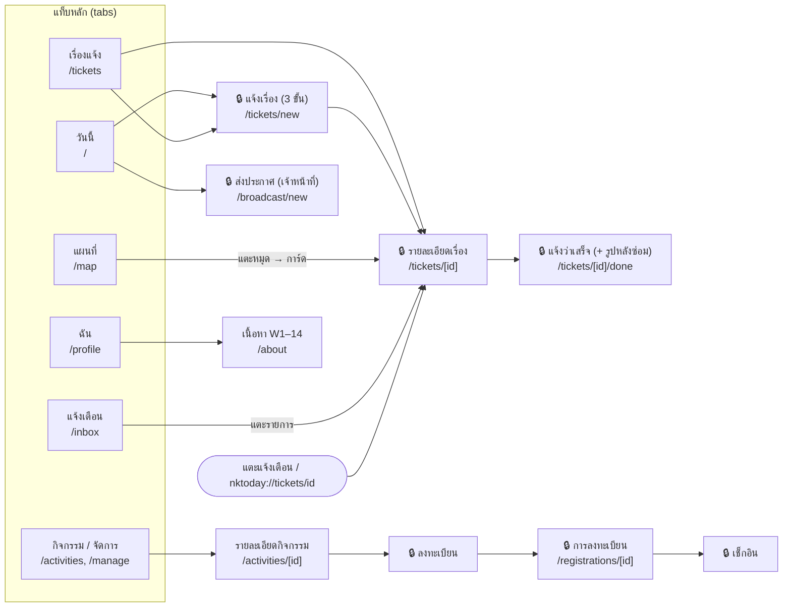
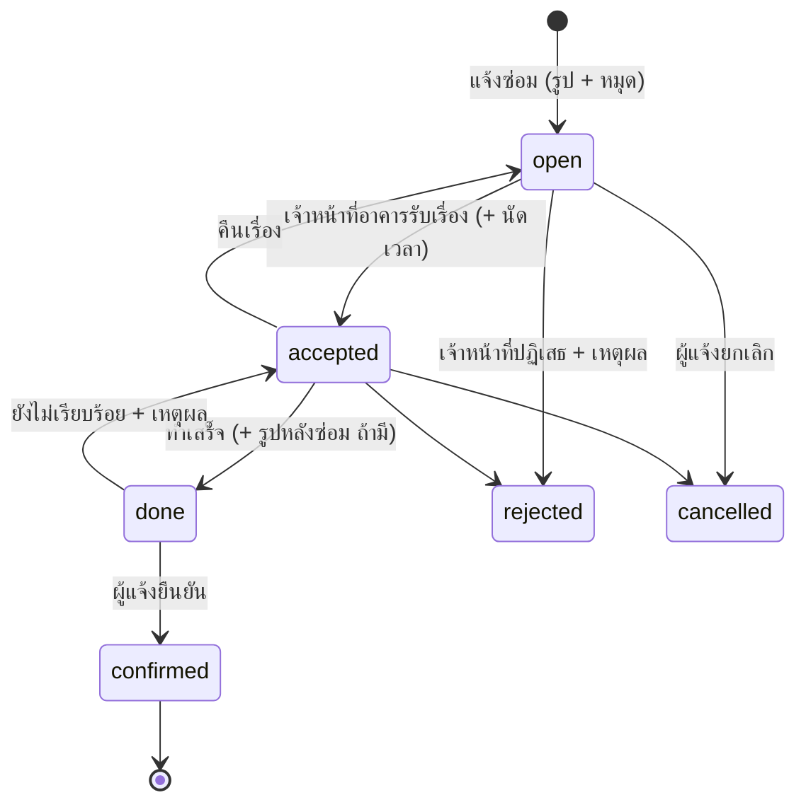
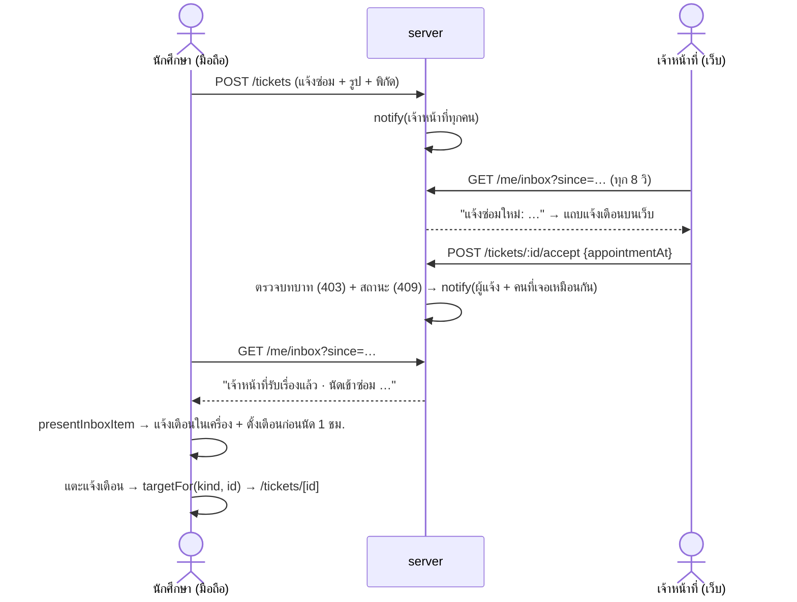
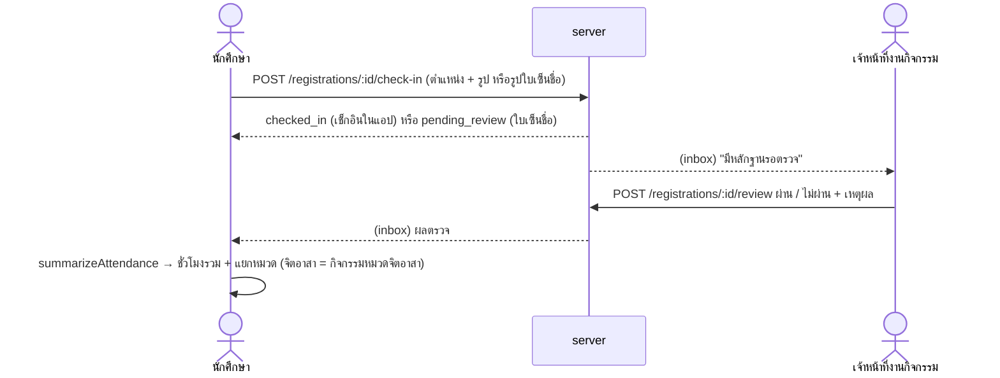
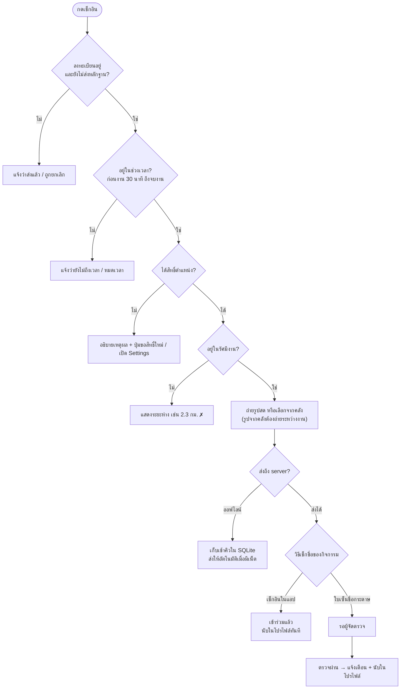
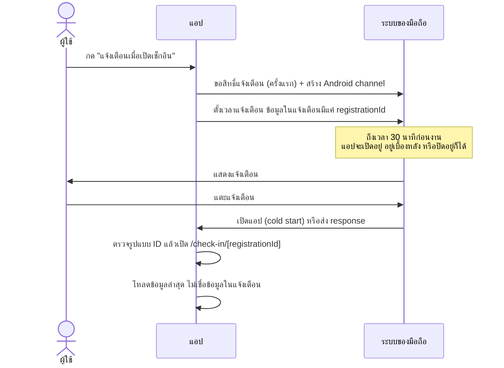
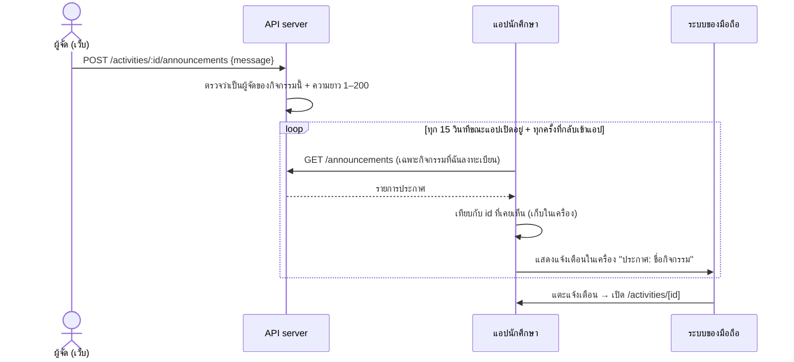
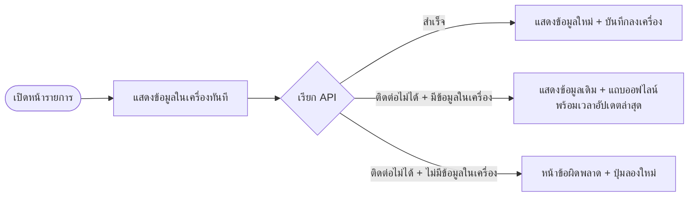
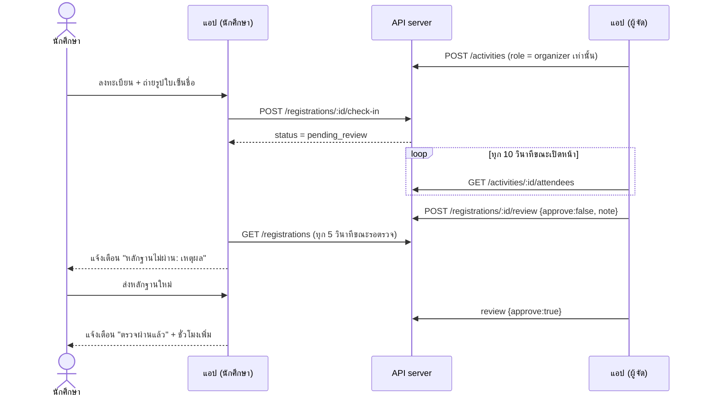
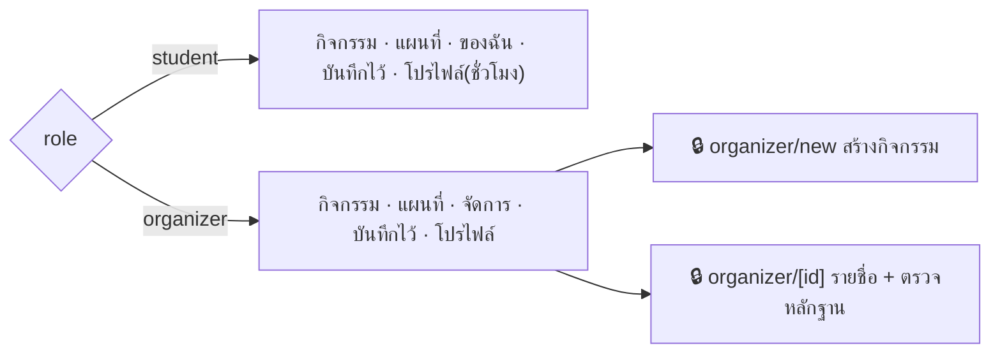

# แผนภาพการทำงานของ KKUNK Today

## 1. แผนผังหน้าจอ (Expo Router)

แท็บหลัก 6 หน้าอยู่ใน `(tabs)` (แท็บ "กิจกรรม" ของนักศึกษาเปลี่ยนเป็น "จัดการ" สำหรับเจ้าหน้าที่) หน้ารายละเอียดและฟอร์มอยู่ใน Root Stack จึงมีปุ่มย้อนกลับอัตโนมัติ
หน้าที่มีกุญแจ 🔒 ต้อง Login ก่อน (`Stack.Protected`)

## 2. วงจรของเรื่องแจ้งซ่อม

## 3. กล่องแจ้งเตือน: อีกฝั่งกด → เครื่องนี้เด้ง

## 4. ชั่วโมงกิจกรรม/จิตอาสา: มาจากการเข้าร่วมกิจกรรมเท่านั้น

---

# ส่วนกิจกรรมและเช็กอิน

## 5. ขั้นตอนเช็กอิน

ตรวจตามลำดับที่ผู้ใช้ควรรู้ก่อน: สถานะ → เวลา → ตำแหน่ง → รูป (`src/lib/check-in-rules.ts`)
server ตรวจเวลาและระยะทางซ้ำอีกรอบ เพราะค่าที่ส่งจากแอปแก้ไขได้

## 6. วงจรการแจ้งเตือนของกิจกรรม

### 3.1 ประกาศจากผู้จัด (ไม่ต้องมี push server)

## 7. การอ่านข้อมูลแบบออฟไลน์ก่อน (offline-first)

## ฝั่งผู้จัดกิจกรรมและการตรวจหลักฐาน (Final)

## แท็บตาม role

